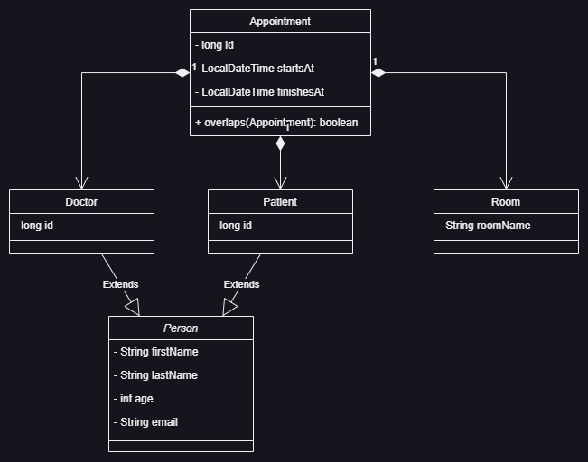

# Gestión de Citas para el Hospital AccWe

## Contexto

Debido a recientes ataques informáticos a varios hospitales de la zona, se ha propuesto renovar el sistema de control de citas en el hospital AccWe. El sistema anterior ha sido parcialmente salvado y limpiado para evitar posibles errores. Esta renovación incluye la actualización de librerías y la implementación de nuevas funcionalidades para mejorar la gestión de citas.

## Objetivos

1. **Creación de Citas a través de la API**: Implementar la funcionalidad para crear citas mediante la API, teniendo en cuenta las limitaciones y especificaciones dadas. Esta implementación se realiza en el archivo `AppointmentController.java`.

2. **Pruebas JUnit para Entidades y Controladores**: Desarrollar pruebas JUnit para cada entidad en el archivo `EntityUnitTest.java` y para cada controlador en el archivo `EntityControllerUnitTest.java`.

3. **Código Limpio**: Asegurarse de que el código esté libre de errores y vulnerabilidades, siguiendo prácticas de código limpio y estándares de seguridad.

4. **Despliegue Escalable con Docker y Kubernetes**: Crear Dockerfiles para ejecutar una base de datos MySQL y el microservicio. Se requiere un Dockerfile Multistage para ejecutar primero las pruebas y, si todas pasan, compilar y ejecutar el microservicio. Los Dockerfiles se nombran `Dockerfile.mysql` y `Dockerfile.maven` respectivamente.

5. **(Opcional) Diagrama UML**: Desarrollar un diagrama UML que muestre todas las relaciones entre clases.

## Desarrollo

### 1. Creación de Citas a través de la API

### Descripción General

La funcionalidad para crear citas a través de la API se ha implementado en el archivo `AppointmentController.java`. Esta funcionalidad permite a los usuarios registrar nuevas citas médicas, asegurando que no haya conflictos de horarios y que las citas cumplan con ciertas validaciones.

#### Endpoint

- **Ruta**: `/api/appointment`
- **Método**: `POST`

#### Validaciones

1. **Fecha y Hora**: La fecha y hora de inicio de la cita deben ser anteriores a la fecha y hora de finalización. Si ambas fechas son iguales o la fecha de inicio es posterior a la fecha de finalización, se devuelve un error `BAD_REQUEST`.

2. **Superposición de Citas**: Antes de guardar una nueva cita, el sistema verifica si hay alguna superposición con citas existentes. Si se detecta una superposición, se devuelve un error `NOT_ACCEPTABLE`.

#### Implementación

El método `createAppointment` en el controlador `AppointmentController.java` se encarga de recibir la información de la cita a través de una petición POST. Se realizan las validaciones mencionadas anteriormente y, si todo está en orden, se guarda la cita en la base de datos.

### 2. Pruebas JUnit

### Entidades

Para cada entidad, se han realizado pruebas que cubren los principales escenarios de uso, incluyendo la creación, modificación, consulta y eliminación de registros. Además, se han considerado casos límite y situaciones de error.

#### Ejemplo: Doctor

- **Descripción**: Pruebas que validan la correcta gestión de la entidad Doctor, incluyendo validaciones de campos y relaciones con otras entidades.
- **Cobertura de código**: Se ha alcanzado una cobertura significativa, cubriendo tanto escenarios comunes como excepcionales.
- **Tests destacados**: Se han realizado pruebas específicas para validar la asignación de pacientes, la gestión de horarios, entre otros.

### Controladores

Para los controladores, se han desarrollado pruebas que simulan las peticiones HTTP y validan las respuestas obtenidas. Estas pruebas garantizan que la API responde adecuadamente y que se gestionan correctamente los posibles errores.

#### Ejemplo: DoctorController

- **Descripción**: Pruebas que validan las operaciones CRUD a través de la API para la entidad Doctor, así como otras operaciones específicas.
- **Cobertura de código**: Se ha logrado una amplia cobertura, validando tanto respuestas exitosas como situaciones de error.
- **Tests destacados**: Se han realizado pruebas para validar la búsqueda de doctores por especialidad, la asignación de pacientes, entre otros.

**Nota**: Recomendamos revisar el código de las pruebas para obtener detalles específicos sobre cada caso de prueba y las validaciones realizadas.

### 3. Dockerfiles

Hemos creado dos Dockerfiles para facilitar el despliegue de nuestra aplicación:

1. `Dockerfile.mysql`: Para ejecutar una instancia de MySQL.
2. `Dockerfile.maven`: Un Dockerfile Multistage que primero ejecuta las pruebas y, si todas pasan, compila y ejecuta el microservicio.

#### Dockerfile.mysql

Este Dockerfile se basa en la imagen oficial de MySQL 8.0 y está configurado para iniciar una base de datos llamada `accwe-hospital` con una contraseña de root establecida.

#### Construcción
```
docker build -f Dockerfile.mysql -t my-mysql-image .
```

#### Dockerfile.maven
Este Dockerfile Multistage consta de dos etapas:

1. Etapa de construcción: Utiliza la imagen maven:3.6-jdk-8 para ejecutar las pruebas y empaquetar la aplicación.
2. Etapa de ejecución: Utiliza la imagen openjdk:8-jre para ejecutar el microservicio empaquetado en la etapa anterior.
#### Construcción
```
docker build -f Dockerfile.maven -t my-maven-image .
```

### 4. Diagrama UML

#### Diagrama UML de Clases

A continuación, se presenta el diagrama UML de clases que describe la estructura de las entidades en nuestra aplicación:



#### Descripción:

- **Doctor**, **Patient** y **Room** son componentes de **Appointment**. Esto significa que si se elimina una cita (`Appointment`), también se eliminarán las entidades asociadas como `Doctor`, `Patient` y `Room`. Aunque esta relación puede parecer inusual, es cómo está modelado en el proyecto Spring Boot.

- Tanto **Doctor** como **Patient** heredan de **Person**, lo que indica que comparten atributos y comportamientos comunes definidos en la clase `Person`.

> **Nota:** Considerando que en las entidades de Java se ha utilizado el atributo `CascadeType.ALL`, esto desencadenaría efectos en cascada al eliminar una cita, afectando a otras entidades relacionadas. Aunque en la práctica no siempre es recomendable usar este tipo de cascada, en el contexto de este proyecto fue necesario para cumplir con ciertos requisitos y simplificar algunas operaciones.


## Instrucciones de Uso


### Requisitos previos

- Java 8 o superior.
- Maven.

### Clonar el repositorio y la rama 

```
git clone -b feature/appointments-management-tests-deployment https://github.com/nuwe-reports/64ea0dab9446ffa27bce2e4a.git
cd 64ea0dab9446ffa27bce2e4a
```
### Ejecutar pruebas
Para ejecutar las pruebas del proyecto:

```
mvn test
```

---

## Agradecimientos y Consideraciones Finales

Quiero agradecer al equipo de revisión por tomarse el tiempo de evaluar este proyecto.

Si hay cualquier aspecto del código o de la documentación que requiera aclaración, o si tienen sugerencias para mejorar, por favor, no duden en comunicármelo. Estoy abierto al feedback y siempre busco aprender y mejorar.

Gracias por su atención.

**_Atentamente,_**  
**Enrique Ansa**
